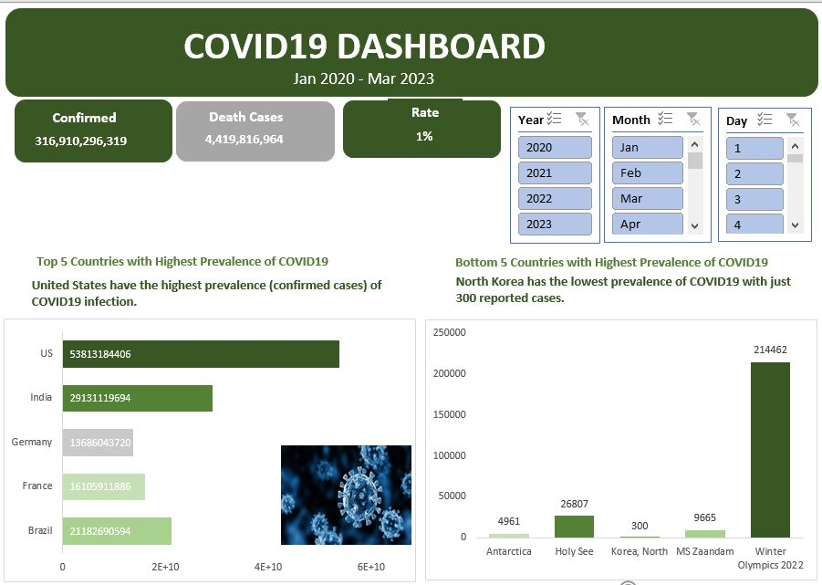
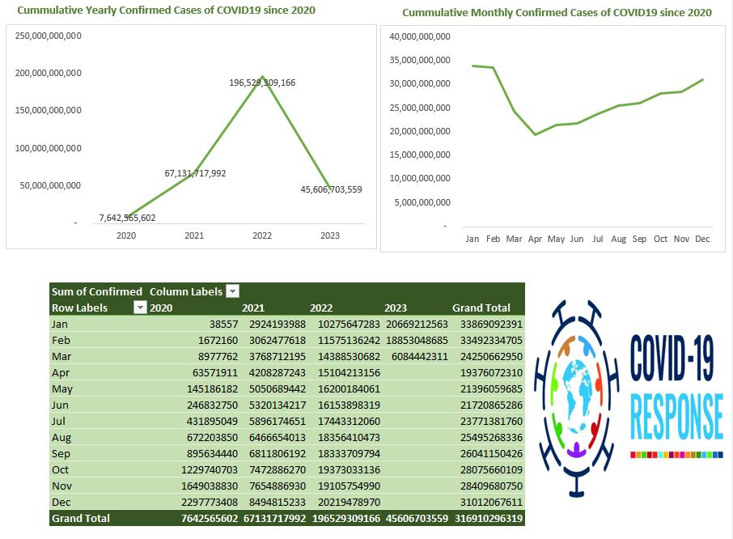

# Analysis on Covid 19 

## Introduction
This is a Microsoft Excel project on analysis of **Covid 19**. 
This report contains daily case reports of confirmed, deaths and recovered cases globally from January 2020 - March 2023.
This dataset was linked to this URL: https://github.com/CSSEGISandData/COVID-19/tree/master/csse_covid_19_data
and will be updated whenever fresh data is added.

## Problem Statement
1. Top 5 Countries with Highest Prevalence of Covid 19
2. Bottom 5 Countries with Highest Prevalence of Covid 19
3. Cummulative Yearly Confirmed Cases of Covid 19 since 2020
4. Cummulative Yearly Confirmed Cases of Covid 19 since 2020

## Skills demonsrated
- Power Query
- Data Cleaning
- Pivot Tables
- Pivot Charts
- Filters

## Visualization
_Report showing the Total number of Confirmed cases and Death Cases_

_This is showing the yearly and monthly trend of Confirmed Cases since 2020_

## Analysis
United States have the highest prevalence (confirmed cases) of COVID19 infection while
North Korea has the lowest prevalence of COVID19 with just 300 reported cases.

Yearly Confirmed Cases showed 2022 as the highest peak of almost 200,000 Confirmed Cases of the infection.
Monthly trend shows that January and February were the season of most infected patients, the followiing months showed a decline in the spread of infection
but gradual increase towards the last months of the year.

